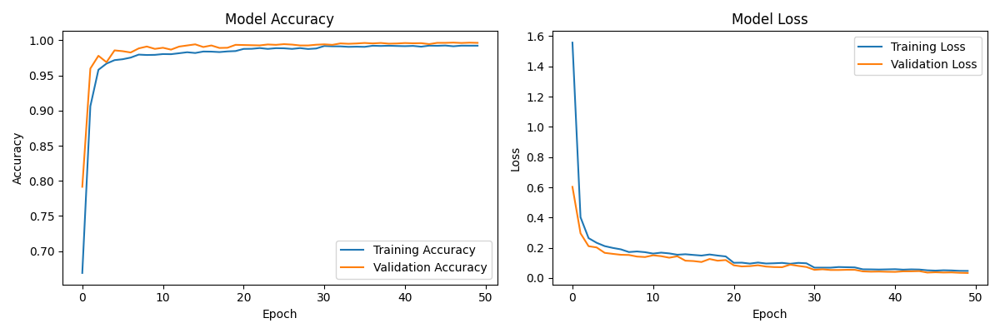
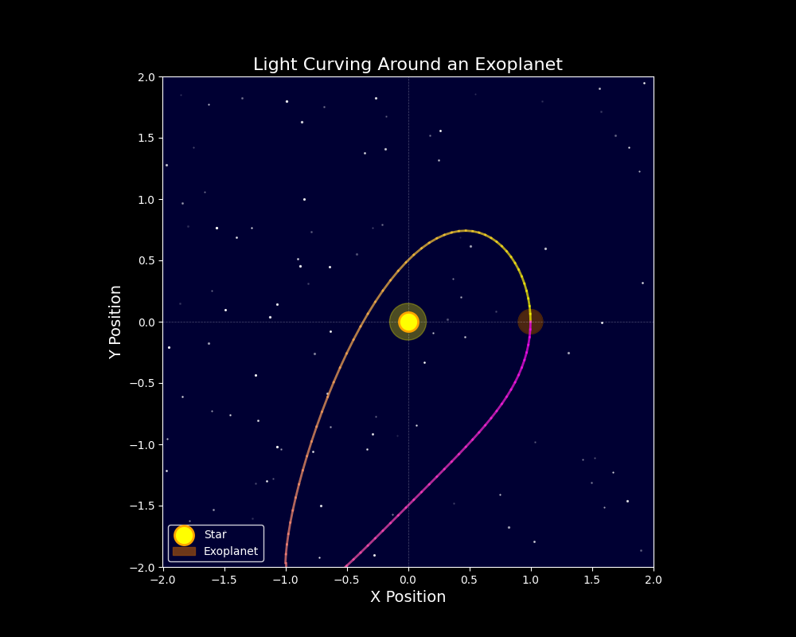
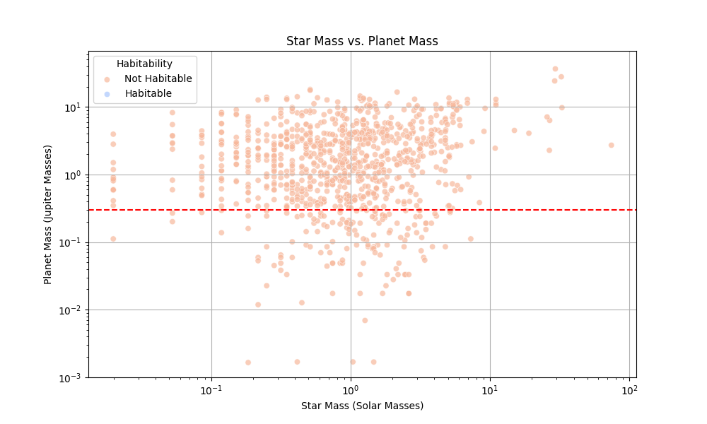
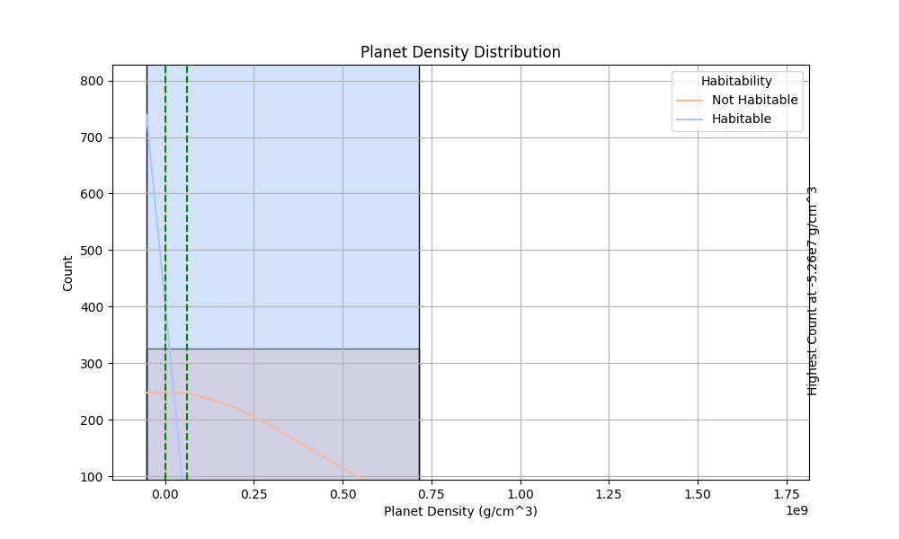
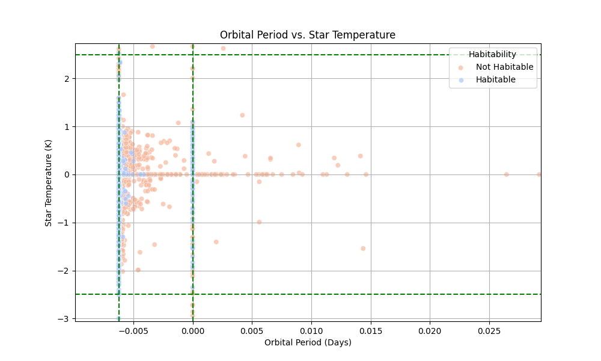

# Exoplanet Detection and Habitability Analysis

## Overview

This repository houses two innovative astrophysical models designed to expirement on our understanding of exoplanetary systems:

1. **Exoplanet Detection via Transit Photometry**
2. **Exoplanet Habitability Classification**

These models leverage advanced machine learning techniques to analyze astronomical data, contributing to the rapidly evolving field of exoplanet science.

## Exoplanet Detection Model

### Methodology

The exoplanet detection model employs Long Short-Term Memory (LSTM) networks to analyze stellar photometric time series data, specifically light curves obtained from space-based observatories such as Kepler and TESS. This approach allows for the identification of periodic dimming events indicative of planetary transits.The model is built on LSTM networks, which excel in processing sequential data, making them particularly suitable for analyzing light curves generated by exoplanets transiting their host stars. 

### Dataset

The model is trained on a comprehensive dataset comprising __56,461__ light curve samples:
- 27,994 positive samples (confirmed exoplanets)
- 28,467 negative samples (stellar variability, instrumental noise, and other astrophysical phenomena)

### Performance Metrics

- Training Accuracy: 99.24%
- Validation Accuracy: 99.65%
- Test Accuracy: 99.68%
- Precision: 99.98%
- Recall: 99.37%

### Learning Curves




These metrics demonstrate the model's robust capability to discriminate between genuine planetary transits and false positives, even in the presence of complex stellar variability and instrumental artifacts.

## Exoplanet Habitability Classification Model

### Methodology

Building upon our transit detection capabilities, I've developed a hybrid Convolutional Neural Network (CNN) and LSTM architecture to assess exoplanet habitability, along with implenting data augmentation techniques like weighted combination of features with added noise. This model analyzes a multitude of planetary and stellar parameters to classify potential habitable worlds.

### Key Parameters

- Planetary equilibrium temperature (T_eq)
- Planetary radius (R_p)
- Orbital period (P)
- Semi-major axis (a)
- Stellar effective temperature (T_eff)
- Stellar mass (M_*)
- Stellar metallicity ([Fe/H])

### Performance Metrics

- Training Accuracy: 81.0%
- Validation Accuracy: 80.0%
- Test Accuracy: 81.50%
- Total Samples: 5000[augmented]

## Visualizations

### Transit Light Curve Analysis


This figure illustrates a typical exoplanetary transit light curve, showcasing the characteristic dip in stellar flux as the planet occults its host star.

### Planetary System Characteristics


This scatter plot reveals the relationship between stellar and planetary masses, providing insights into planetary formation processes and system architectures.

### Exoplanet Density Distribution


The density distribution of exoplanets offers crucial information about planetary composition and internal structure, key factors in assessing habitability.

### Orbital Dynamics and Stellar Properties


This visualization explores the correlation between orbital periods and host star temperatures, helping to identify potential habitable zones within diverse stellar environments.

## Key Findings

- The absence of habitable planets within certain mass ranges highlights potential constraints on planetary habitability or limitations in current detection methods.
- Habitable exoplanets exhibit a distinct density distribution, peaking around -5.278 g/cm³ and rapidly declining at higher densities, in contrast to the broader distribution of non-habitable planets.
- The narrow range of stellar temperatures (-2.50 to 2.50 K) and orbital periods (-0.006232 to 0.0 days) for habitable exoplanets suggests highly specific conditions for potential habitability.

## License

This project is licensed under the [MIT License](LICENSE.md).

## Dependencies

- pandas
- numpy
- scikit-learn
- tensorflow
- keras
- matplotlib
- concurrent.futures

## Data Source

[NASA Exoplanet Archive](https://exoplanetarchive.ipac.caltech.edu/cgi-bin/TblView/nph-tblView?app=ExoTbls&config=PS)

## Acknowledgments

I gratefully acknowledge the use of data from the Kepler and TESS missions, as well as the invaluable resources provided by the NASA Exoplanet Archive.

## Disclaimer and Limitations

The exoplanet detection and habitability classification models presented in this project are intended for research and educational purposes. While these models demonstrate high accuracy metrics within their training domains, users should be aware of their limitations and exercise caution when applying them to novel datasets or real-world scenarios.

### Limitations

1. **Dataset Specificity**:
   The models are trained on specific datasets, primarily light curve data from Kepler and TESS missions. Performance may vary when applied to data from other sources or with different characteristics.

2. **Signal-to-Noise Sensitivity**:
   The deep learning architectures (LSTM and CNN-LSTM hybrid) may be sensitive to noise in photometric time series data. Users should be aware of potential false positives or negatives, especially in cases of low signal-to-noise ratios or incomplete light curves.

3. **Astrophysical Complexity**:
   While our models aim to capture the nuances of exoplanetary transits, they may not account for all astrophysical phenomena. Events such as stellar flares, eclipsing binaries, or complex multi-planet systems could potentially lead to misclassifications.

4. **Feature Engineering Constraints**:
   The models rely on a predefined set of features extracted from light curves and planetary system parameters. Factors not explicitly included in our feature set may impact detection and classification accuracy.

5. **Generalization Challenges**:
   While efforts have been made to ensure robustness, the models' performance on datasets significantly different from the training set (e.g., different stellar types, orbital configurations) may be suboptimal. Cross-validation on diverse datasets is recommended.

6. **Model Interpretability**:
   As with many deep learning models, the decision-making process of our LSTM and CNN-LSTM networks is not always transparent. This "black-box" nature can pose challenges for scientific interpretation and may limit insights into the underlying astrophysical processes.

7. **Preprocessing Dependencies**:
   The models' efficacy is contingent on consistent preprocessing of input data. Users should adhere to the preprocessing pipeline detailed in `data_processing.py` to ensure optimal performance.

8. **Computational Resources**:
   The LSTM and CNN-LSTM models, particularly when processing large datasets, may require significant computational resources. Users should be aware of potential memory and processing time constraints, especially when scaling to larger datasets.

9. **Version Dependencies**:
   The models have been developed and tested with specific versions of TensorFlow, Keras, and other dependencies as listed in `requirements.txt`. Compatibility issues may arise with different versions of these libraries.

10. **Ongoing Validation**:
    As new exoplanet discoveries are made and our understanding of planetary systems evolves, continuous validation and potential retraining of the models may be necessary to maintain accuracy and relevance.

Users are encouraged to carefully consider these limitations, validate the models' performance on their specific datasets, and interpret results in the context of current astrophysical knowledge. For production or mission-critical applications, additional verification and expert consultation are strongly recommended.

```bash
git clone https://github.com/Rohnnam/Exoplanetary-Dynamics-Simulator.git
cd Exoplanetary-Dynamics-Simulator
pip install -r requirements.txt
python main.py

